# 🎬 Desafio - Sprint 10  

Nesta sprint final do **desafio de filmes e séries**, nosso objetivo foi analisar os dados disponíveis na camada **Refined** do **Bucket S3** e criar um **dashboard** para extrair insights significativos.  

Minha **squad** teve como tema de análise os **gêneros Terror e Mistério**. Dentro desse contexto, escolhi investigar os filmes baseados na obra de **Stephen King**, um autor icônico desses gêneros, cuja escrita foi inúmeras vezes adaptada para o cinema e muito lembrado por obras marcantes como O Iluminado, Cujo, It, Carrie e Cemitério Maldito entre tantas outras.

## 🎯 Questões de Pesquisa  

1. **Qual é a porcentagem de filmes relacionados a Stephen King que pertencem ao gênero terror/mistério em comparação com outros gêneros?**  
2. **Dentro do gênero terror/mistério, qual a porcentagem de filmes em que o autor teve o papel de escritor? Ele teve maior participação nesse papel? Ele assumiu outras funções além de escritor nos filmes?**  
3. **Qual é a década de lançamento predominante nos filmes mais populares? Eles tiveram mais sucesso em décadas anteriores ou ainda mantêm relevância atualmente?**  
4. **Quais foram os filmes mais populares?**  
5. **Qual a diferença entre orçamento e receita dos filmes por década?**  
6. **Os filmes mais rentáveis foram também os mais bem avaliados? Existe alguma relação entre popularidade e sucesso financeiro?**  
7. **Há alguma correlação entre diretores ou produtoras específicas e o lucro dos filmes?**  
8. **Quais foram os orçamentos, bilheterias e lucros dos filmes? Quais os filmes mais rentáveis (considerando a diferença entre o custo de produção e a arrecadação de bilheteria)?**  

## Primeiros Passos para a analise
Para iniciar carreguei as tabelas que haviam sido criadas no Glue Data Catalog, usei o athena para essa tarefa, além disso fiz os joins necessários.

O esquema dessas tabelas relacionadas ficou assim:

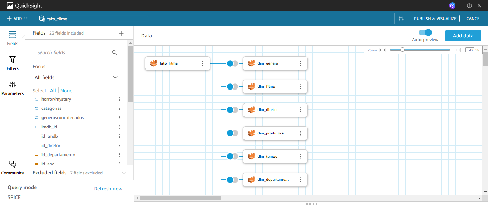

Aqui o resultado do dataset com as tabelas.

# 

## Análise

Com o dataset criado e os joins devidamente feitos comecei a analise por descobrir a resposta a seguinte pergunta: 

**Qual é a porcentagem de filmes relacionados a Stephen King que pertencem ao gênero terror/mistério em comparação com outros gêneros?**  

Para responder essa questão criei um campo calculado que identificava se o genero ao qual o filme pertencia era horror, mystery, thriller ou outros e selecionei o campo de id_tmdb como value contando apenas os ids distintos, como eram pouca categorias optei por fazer um gráfico de donut e esse foi o resultado:

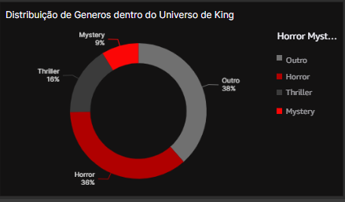

Assim chegamos a resposta dessa pergunta, dentro do universo dos filmes analisados 9% se encaixam no genero Misterio, 16% no genero Thriller, 36% no genero Horror e 38% em todos os outros generos, sendo eles ação, drama, comédia, aventura, crime, fantasia, romace e sci-fi, o que realmente comprova que o nicho favorito de Stephen King é horror, misterio e thriller.

Ainda nesse mesmo assunto, fiz um segundo gráfico de donut considerando apenas os filmes que são desses três generos e portanto os que usarei na minha analise, para saber a divisão entre esses generos e esse foi o resultado.

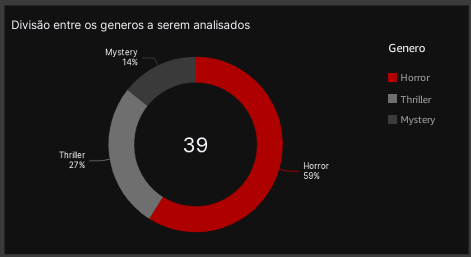

Portanto em um universo de 39 filmes analisados, 59% são do genero Horror, 27% Thriller e 14% Misterio, de fato, podemos realmente chama-lo de o mestre do horror.

A partir desse ponto da analise, em todos os graficos usei um filtro para apenas visualizar filmes de horror, misterio e thriller que são os generos base da minha analise.

A próxima pergunta a ser respondida era: 

**Dentro do gênero terror/mistério, qual a porcentagem de filmes em que o autor teve o papel de escritor? Ele teve maior participação nesse papel? Ele assumiu outras funções além de escritor nos filmes?**  

Para responder essa pergunta usei os campos id_tmdb e departament, e optei por um grafico de pizza, com isso consegui descobrir que Stephen King se envolve majoritariamente como escritor, tendo a participação como Crew (produtor, diretor e ator) em uma pequena porcentagem das produções. Esse foi o resultado do gráfico.

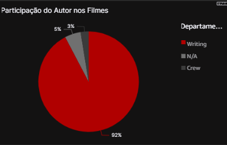

Quando comecei essa analise tinha essa hipótese como certa e realmente ela se confirmou, o envolvimento do autor em outros campos das produções é minímo, o que ele realmente gosta é de escrever, e por sua maestria como escritor suas obras são tão adaptadas para as telas.

**Qual é a década de lançamento predominante nos filmes mais populares? Eles tiveram mais sucesso em décadas anteriores ou ainda mantêm relevância atualmente?**  

Sabemos que a década iconica do horror no cinema foram os anos 80, mas será que filmes baseados na obra do autor seguem esse padrão?
Para fazer esse gráfico usei os indices de popularidade do imdb e tmdb e as decadas de lançamentos das produçoes, havia criado esse campo década na sprint anterior na tabela de dim_tempo e utilizei ele aqui.
Esse foi o resultado do gráfico:

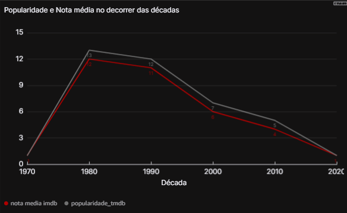

Esse gráfico realmente mostra que o auge da popularidade dessas produções foi os anos 80 e 90, (nas duas fontes de dados o gráfico faz o mesmo trajeto, o que comprova que as duas fontes de dados tem confiabilidade) tendo visto um declinio nas últimas decadas no quesito popularidade.

**Quais foram os filmes mais populares?**  

Para responder essa questão utilizei o indice de popularidade do tmdb, e escolhi trazer os 10 filmes com maior popularidade, o gráfico a seguir mostra o resultado.

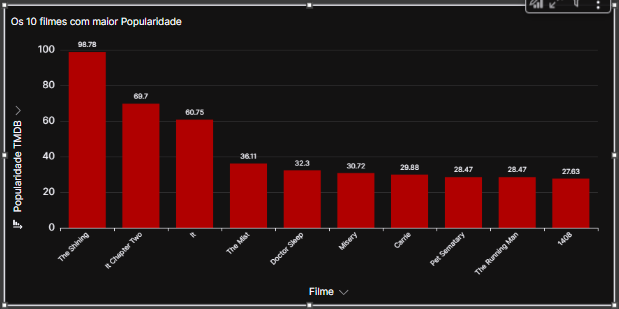

O iluminado, da década de 80, um dos filmes mais lembrados de terror se destaca no quesito popularidade, confirmando a hipotese da pergunta anterior que a década de 80 foi muito boa para o genero, seguido pelos mais recentes It e It capítulo 2.

**Qual a diferença entre orçamento e receita dos filmes por década?** 

Já sabemos que os anos 80 e 90 foram o auge da popularidade dos filmes baseados na obra de Stephen King, mas e quanto aos orçamentos e as receitas dessas produções? Para descobrir no decorrer da décadas qual foi a variação desses campos utilizei um grafico de linhas. O resultado foi o seguinte:

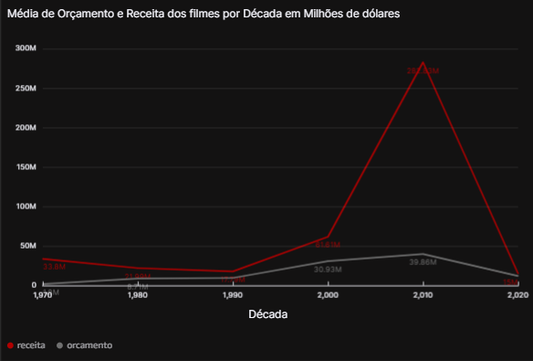

Podemos notar que embora os orçamentos tenham crescido durante as décadas, houve uma explosão expressiva na receita na década de 2010. A frente nessa análise veremos quais filmes foram responsaveis por esse crescimento na receita.

**Os filmes mais rentáveis foram também os mais bem avaliados? Existe alguma relação entre popularidade e sucesso financeiro?**  

Fiz um gráfico de dispersão para mostrar a relação entre popularidade X lucro liquido

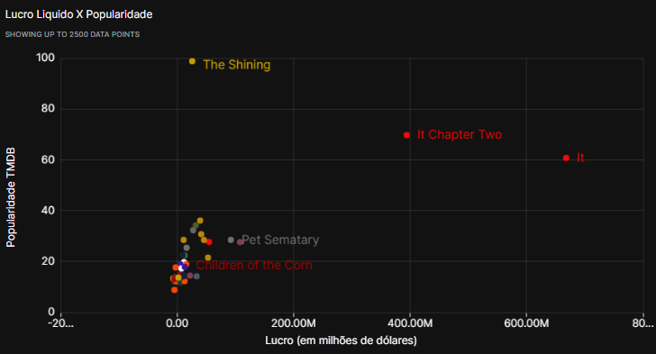

Podemos notar que O iluminado, é realmente popular, embora tenha sido feito com um orçamento não muito expressivo, também se destacam nesse gráfico It 🎈 e It 2 🎈, os demais filmes podemos notar tiveram tanto um orçamento quanto popularidades parecidos.

**Há alguma correlação entre diretores ou produtoras específicas e o lucro dos filmes?** 

Quanto as produtoras mais lucrativas tivemos o seguinte resultado, nessa analise escolhi pegar as 15 mais lucrativas.

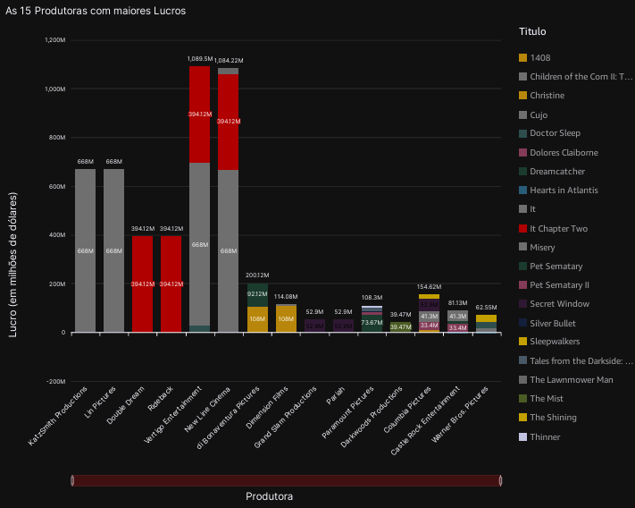

Podemos notar que as produtoras que estiveram envolvidas nas produções de It 🎈 e It capítulo2 🎈 explodiram em lucratividade, sendo elas KatzSmith Production, Lin Pictures, Vertigo Entertainment, Rideback, Double Dream e New Line Cinema. 1408 também é um filme que contou com uma boa lucratividade para as produtoras Di Bonaventura e Dimension Films, ao mesmo tempo, mesmo produzindo mais de um filme as demais produtoras tiveram lucros parecidos.

Quanto aos diretores esses são os 10 mais lucrativos. 

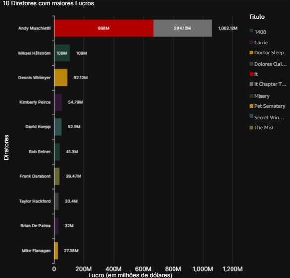

Andy Muschietti diretor de It 🎈 e It capítulo 2 🎈 é o grande destaque nessa analise, podemos ver a diferença enorme entre ele e o segundo colocado Mikael Håfström por 1408.

**Quais foram os orçamentos, bilheterias e lucros dos filmes? Quais os filmes mais rentáveis (considerando a diferença entre o custo de produção e a arrecadação de bilheteria)?**  

Para responder essa última pergunta utilizei orçamento, lucro liquido e receita usei aqui todos os filmes e colocarei o gráfico dividido em duas partes para melhor visualização.

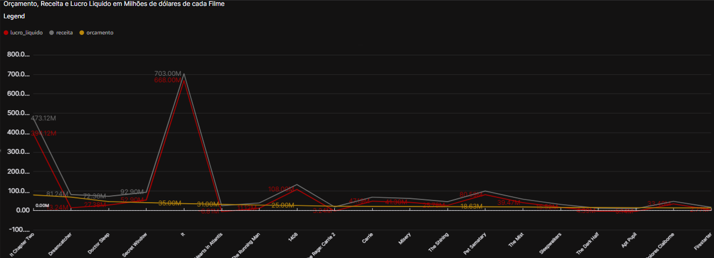

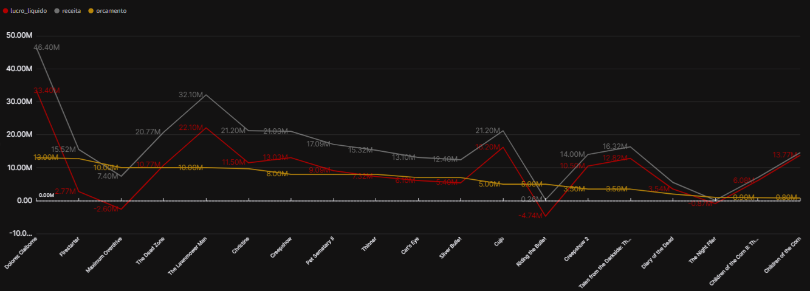

Podemos notar que o grande destaque fica por conta de It 🎈 e It capítulo 2 🎈 com lucros estratosféricos, é interessante notarmos os próximos em lucratividade 1408, Cujo e Cemitério Maldito.

## Conclusão

Com essa análise pude perceber que Stephen King continua sendo relevante com o passar das décadas, embora O Iluminado tenha sido o grande sucesso do autor em termos de popularidade, e outros filmes baseados em livros, filmados na década de 80 e 90 sejam lembrados até hoje como clássicos do genero de Terror, It e It capítulo 2 chegaram em 2017 e 2019 respectivamente (são baseados no livro de 1986) e explodiram em lucro, foram bastante populares e trouxeram para o diretor e produtoras bilheterias expressivas.

Após o lançamento do primeiro filme em 2017, It entrou na lista de best-sellers novamente, vendendo milhões de cópias ao redor do mundo. Houve também um aumento geral no interesse pelas obras de Stephen King, com outros livros do autor ganhando mais destaque.

O sucesso das adaptações também fez com que novas edições do livro fossem lançadas, muitas delas com capas inspiradas no filme.

Portanto, se as produtoras de cinema desejarem adptar outras obras do autor, ou até mesmo fazer remakes de filmes, podemos concluir que há grandes chances desses se tornarem sucesso de público ainda nos dias de hoje, as editoras que tem os direitos dos livros também irão se beneficiar financeiramente e os fãs do mestre do horror vão se deleitar de ver as melhores histórias de terror e mistério saírem dos livros e ganharem vida nas telas. 🎈

---  

Gostaria de encerrar este **README** com a seguinte frase de **Stephen King**:  

> **"You can, you should, and if you’re brave enough to start, you will."**  
> *"Você pode, você deve, e se for corajoso o suficiente para começar, você o fará."*  

Que **desafio enorme** foi este programa de bolsas! Mas aqui estou: com **coragem para começar** e **resiliência para não desistir**, cheguei ao final com uma sensação de **enorme aprendizado e crescimento**, tanto profissional quanto pessoal.  

**Muito obrigada a todos os envolvidos!** 🚀🎥  
