# Desafio - Sprint 2

Nesta sprint, o desafio foi aplicar as formas normais a uma base de dados e, posteriormente, converter o modelo relacional em dimensional. Confesso que todos esses conceitos são novos para mim, o que tornou a tarefa desafiadora. Contudo, dediquei-me para compreender e executar o desafio da melhor forma possível. A seguir, explico os passos que segui para sua realização e espero que minha explicação seja clara.

## Primeira Etapa: Normalização e modelagem Relacional

Inicialmente, fiz um tratamento dos dados da tabela, pois alguns campos de data e hora não estavam configurados corretamente. Aproveitei essa etapa para revisar todos os campos e ajustá-los para garantir consistência. As imagens a seguir ilustram essas alterações:

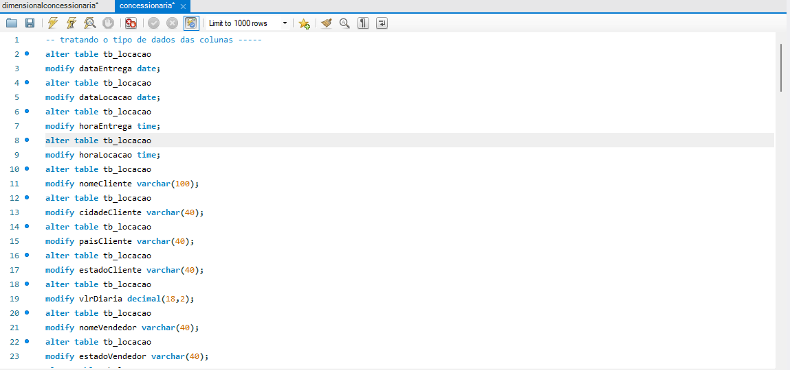
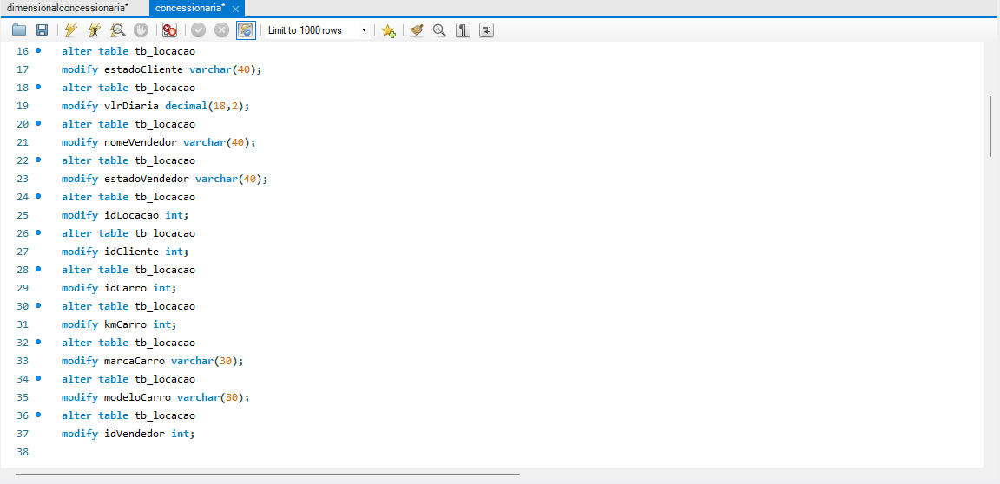

Após essa revisão, comecei a criar tabelas específicas para cada entidade — **cliente**, **veículo**, **combustível** e **vendedor** — e transferi para cada uma delas os dados correspondentes.

### 1. Tabela de Clientes

Para a tabela de clientes, criei uma estrutura onde o campo `idCliente` atua como chave primária. Todos os atributos relacionados aos clientes foram transferidos para esta tabela. Depois, eliminei os dados repetidos na tabela **locação**, conforme exigido no processo de normalização. Também defini `idCliente` como chave estrangeira na tabela **locação** para manter a integridade dos dados, como mostrado na imagem abaixo:

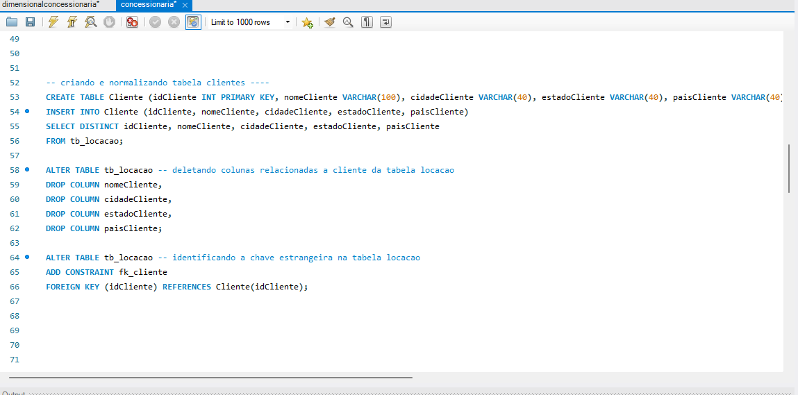

tabela gerada após a execução do código: 
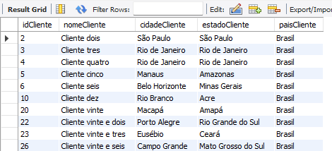

### 2. Tabela de Vendedores

Segui o mesmo procedimento para a tabela de vendedores: `idVendedor` foi definido como chave primária, e todos os atributos relacionados a vendedores foram transferidos para esta tabela. Após a transferência, removi os dados redundantes da tabela **locação** e estabeleci `idVendedor` como chave estrangeira na tabela **locação**, conforme ilustrado na imagem:

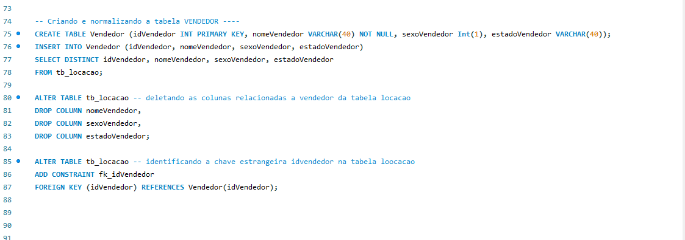

tabela gerada após a execução do código: 
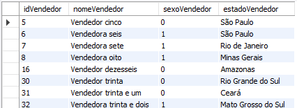

### 3. Tabela de Combustível e Tabela de Veículo

Para a tabela de **combustível**, criei uma estrutura que contém `idCombustivel` e `tipoCombustivel`. Em seguida, criei a tabela **veículo**, incluindo os atributos relacionados aos veículos, e estabeleci uma relação entre essas tabelas usando `idCombustivel`.

Na tabela de veículos, utilizei `idCarro` como chave primária e escolhi manter apenas a quilometragem mais alta registrada para cada carro, evitando duplicidade de dados. Depois disso, removi os dados redundantes da tabela **locação** e excluí `idCombustivel` dela, uma vez que **combustível** está relacionado apenas a **veículo** e não diretamente a **locação**.

As imagens a seguir ilustram essa estrutura:

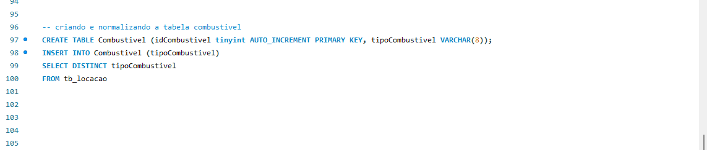

tabela gerada após a execução do código: 
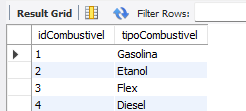

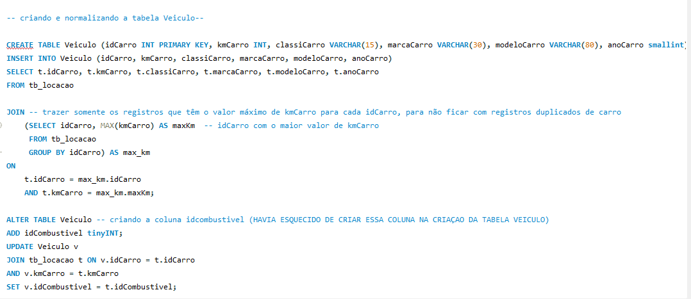
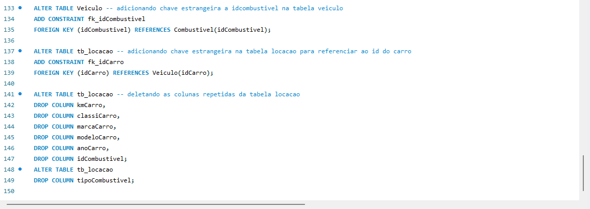

tabela gerada após a execução do código: 
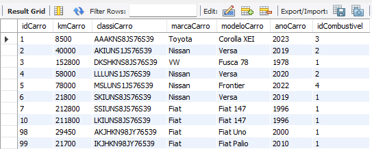
---

Esse processo de normalização ajudou a garantir uma estrutura de dados consistente e evitou a redundância de informações na base de dados.
Gerando a seguinte tabela locação:

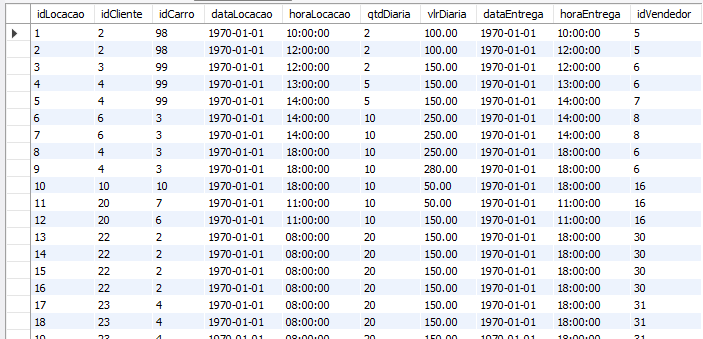
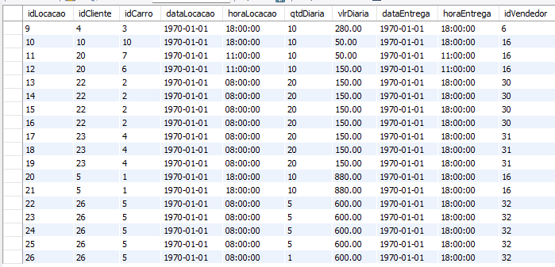

## Resultado do Modelo Relacional

Por fim, o modelo relacional finalizado está representado na imagem abaixo.

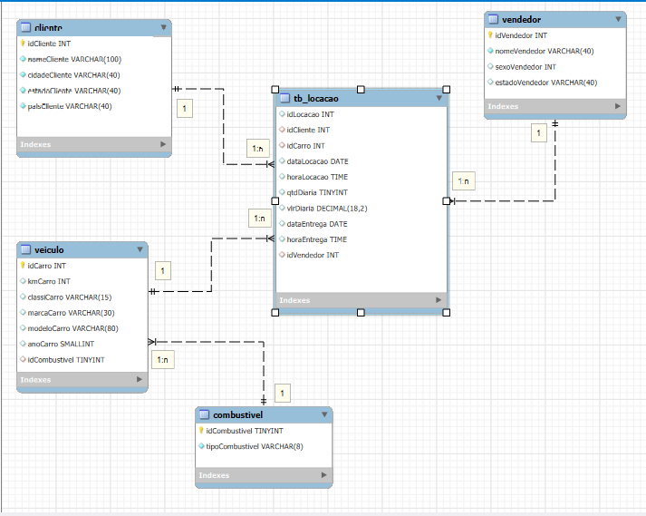