# Sprint 2

## Informações

Nesta segunda sprint, fui introduzida ao SQL para análise de dados. Como não possuía conhecimento prévio sobre o assunto, foi interessante entender o conceito de banco de dados. Embora tenha achado a sintaxe desafiadora no início, foi enriquecedor compreender o funcionamento e os fundamentos dessa área.

## Resumo

### SQL

Aprendi a manipular tabelas, criá-las do zero, relacioná-las, além de entender os conceitos de normalização de banco de dados, modelagem relacional e dimensional. Sinto que adquiri o conhecimento necessário para realizar os exercícios e o desafio da semana, mas reconheço que esse é um tema extenso e complexo, que merece ser explorado com dedicação.

Busquei conteúdos complementares na internet para aprofundar meu entendimento sobre normalização de banco de dados e os modelos relacionais e dimensionais.

### AWS Skill Builder – AWS Partner: Salles Accreditation

O curso da AWS presente nesta trilha apresentou a proposta da Amazon para serviços em nuvem e suas vantagens.

## Exercícios
### biblioteca Udemy
Respostas dos exercícios da biblioteca

1. [Resposta do Exercício 1](../Sprint2/Exercicios/biblioteca/sql/exercicio1.sql)  
2. [Resposta do Exercício 2](../Sprint2/Exercicios/biblioteca/sql/exercicio2.sql)  
3. [Resposta do Exercício 3](../Sprint2/Exercicios/biblioteca/sql/exercicio3.sql)  
4. [Resposta do Exercício 4](../Sprint2/Exercicios/biblioteca/sql/exercicio4.sql)  
5. [Resposta do Exercício 5](../Sprint2/Exercicios/biblioteca/sql/exercicio5.sql)  
6. [Resposta do Exercício 6](../Sprint2/Exercicios/biblioteca/sql/exercicio6.sql)  
7. [Resposta do Exercício 7](../Sprint2/Exercicios/biblioteca/sql/exercicio7.sql)

### loja Udemy
Respostas dos exercícios da loja

8. [Resposta do Exercício 8](../Sprint2/Exercicios/loja/sql/exercicio08.sql)  
9. [Resposta do Exercício 9](../Sprint2/Exercicios/loja/sql/exercicio09.sql)  
10. [Resposta do Exercício 10](../Sprint2/Exercicios/loja/sql/exercicio10.sql)  
11. [Resposta do Exercício 11](../Sprint2/Exercicios/loja/sql/exercicio11.sql)  
12. [Resposta do Exercício 12](../Sprint2/Exercicios/loja/sql/exercicio12.sql)  
13. [Resposta do Exercício 13](../Sprint2/Exercicios/loja/sql/exercicio13.sql)  
14. [Resposta do Exercício 14](../Sprint2/Exercicios/loja/sql/exercicio14.sql)  
15. [Resposta do Exercício 15](../Sprint2/Exercicios/loja/sql/exercicio15.sql)  
16. [Resposta do Exercício 16](../Sprint2/Exercicios/loja/sql/exercicio16.sql)

### exercícios exportados para .csv

Os dois exercícios porpostos, em que os arquivos deveriam ser exportados para a extensao .csv

[codigo da execucao dos dois exercícios](../Sprint2/Exercicios/exercicios.csv/codigoexercicio.sql)

1. [exercício 5 maiores editoras](../Sprint2/Exercicios/exercicios.csv/5maioreseditoras.csv)
2. [exercício livros mais caros](../Sprint2/Exercicios/exercicios.csv/livrosmaiscaros.csv)

## Evidências
### biblioteca Udemy
A seguir seguem as evidencias da execução dos exercícios biblioteca

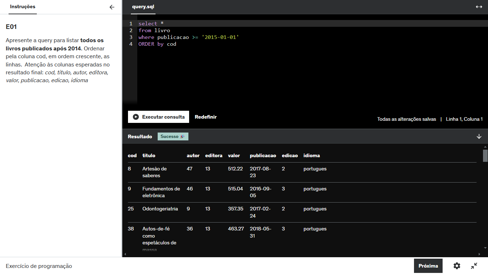
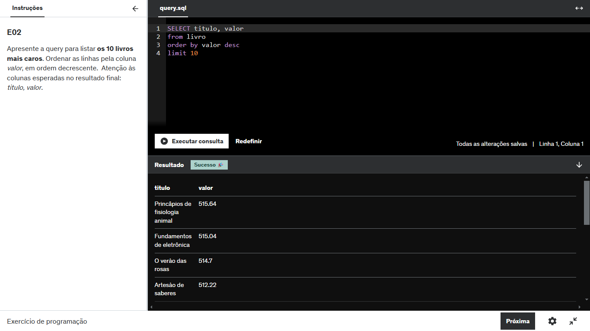

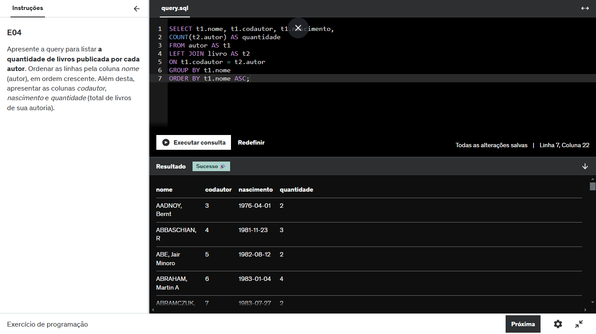
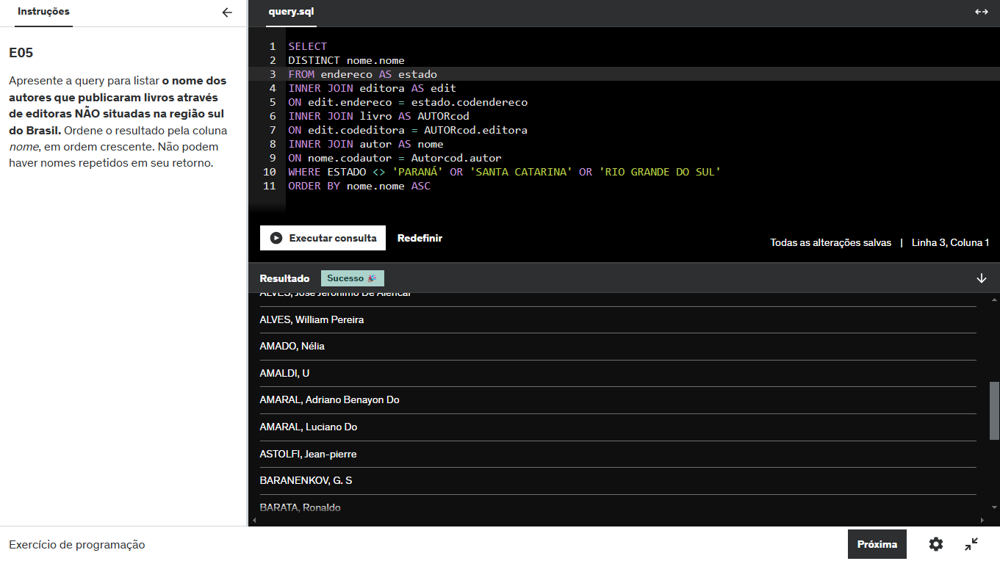
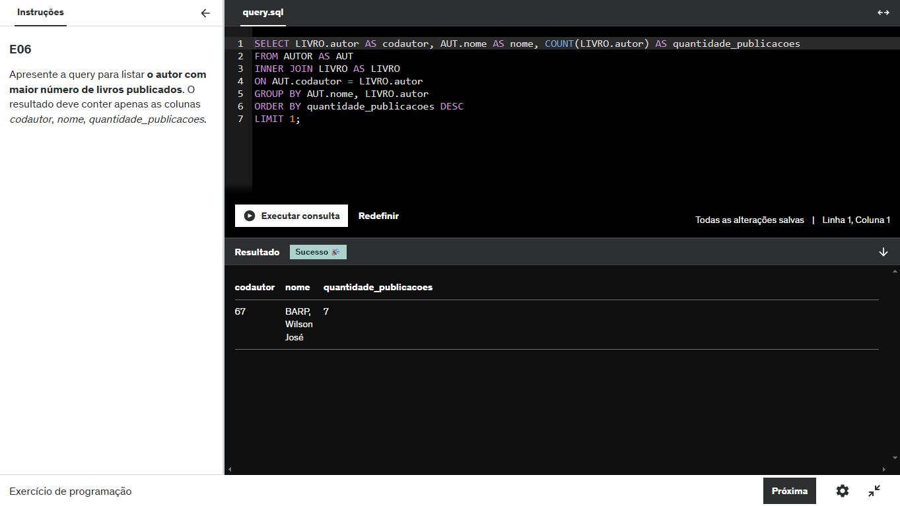
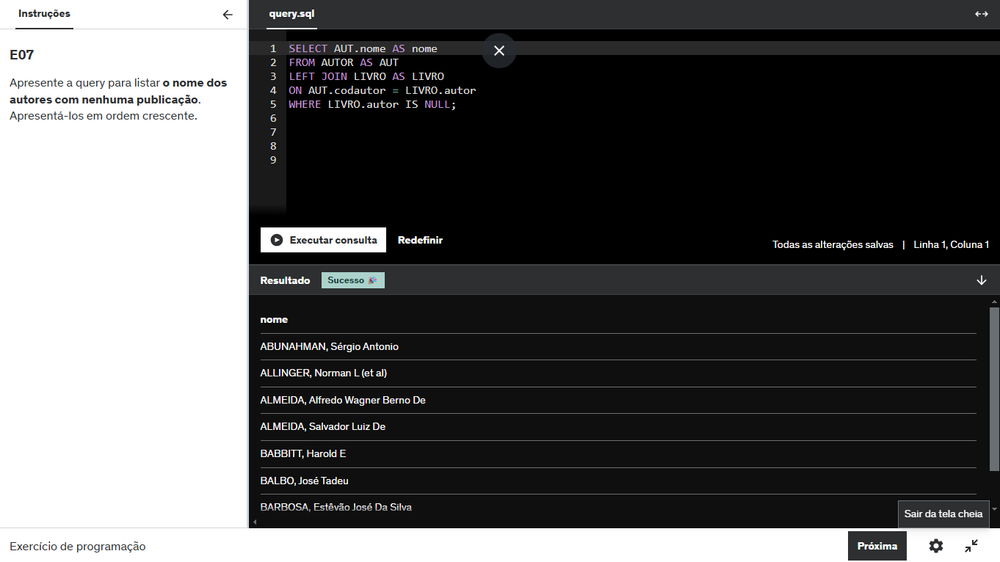

### loja Udemy
A seguir seguem as evidencias da execução dos exercícios loja

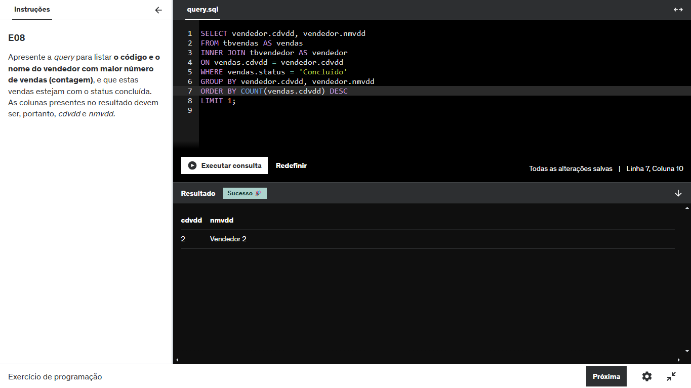
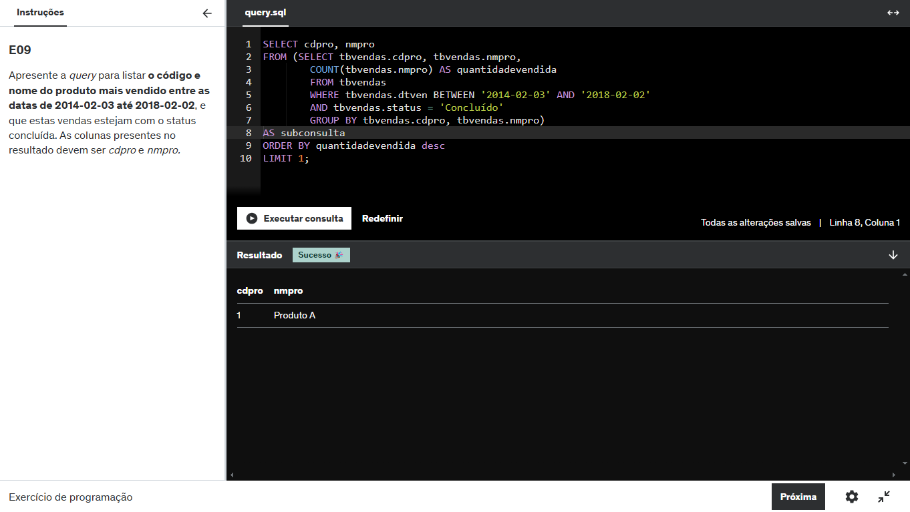
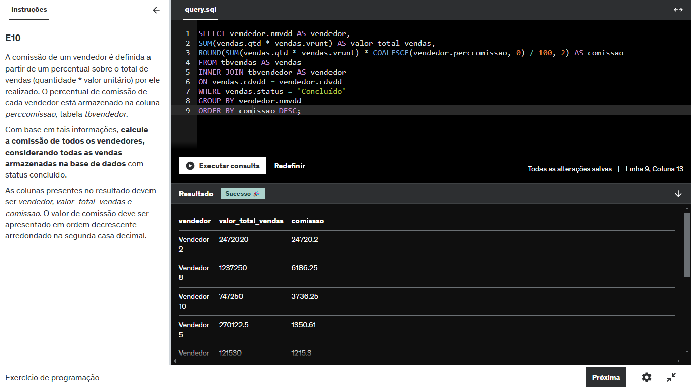
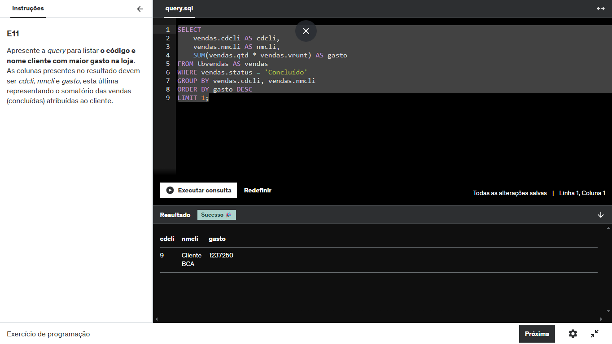
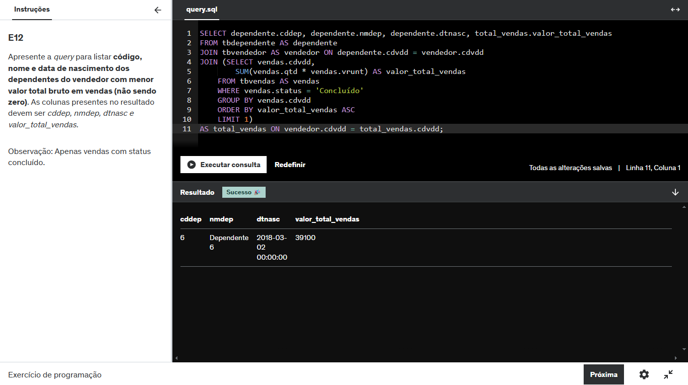
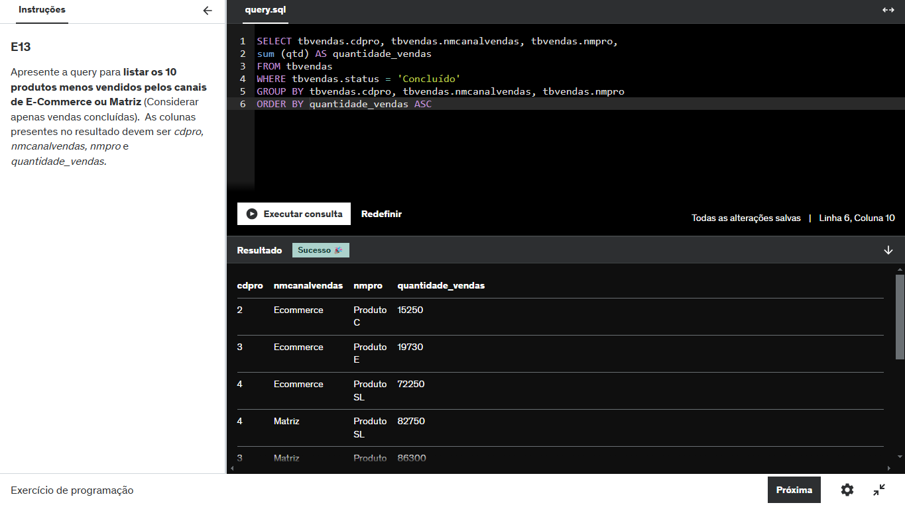
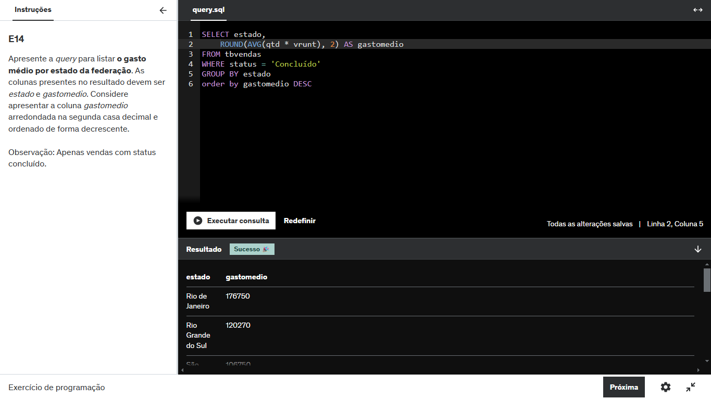
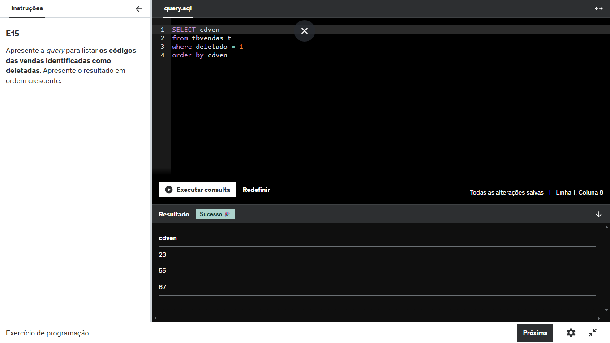
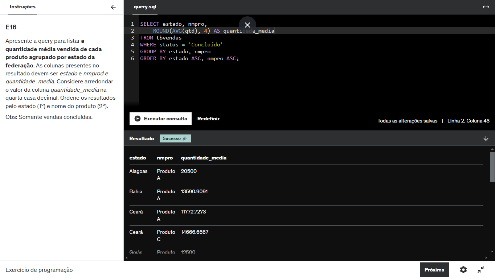

## Certificados

