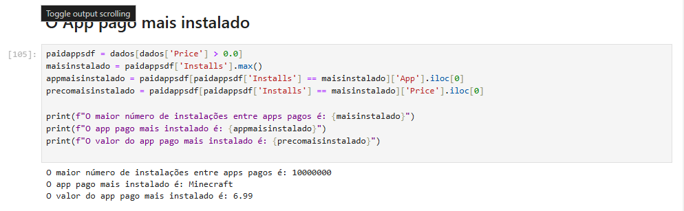
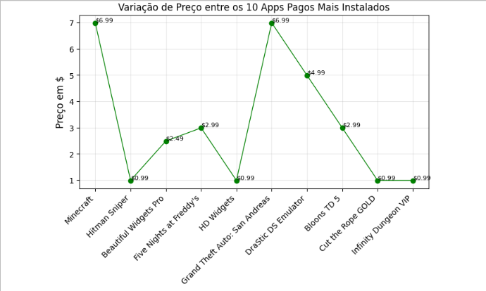

# Desafio Sprint 3

## Objetivo
O desafio da Sprint 3 consistiu em **ler, processar, analisar e gerar gráficos** a partir dos dados fornecidos em um arquivo `.csv`, que continha informações sobre aplicativos da Google Play Store.

Embora eu esteja aprendendo Python e suas bibliotecas durante essa Sprint, e os conceitos ainda sejam novos para mim, devo dizer que **amei fazer esse desafio**. Foi incrível descobrir as possibilidades de análise de dados, tornando este o desafio que mais gostei de trabalhar até agora no programa de bolsas.

---

## Passos para a Execução do Desafio

### **Passo 1: Remoção de Linhas Duplicadas**
Após consultar o monitor técnico, fui informada de que uma linha seria considerada duplicada apenas se **todos os seus campos contivessem exatamente as mesmas informações**. Para atender a esse critério, utilizei o método `drop_duplicates()`. O código e a imagem com o resultado estão demonstrados abaixo.

### **Tratamento de Dados**
Ao explorar o dataset, identifiquei uma **categoria incomum chamada "1.9"**. Analisando mais profundamente, percebi que essa categoria era resultado de uma linha deslocada a partir da coluna `Category`. Como se tratava de uma única linha com dados irrelevantes na minha avaliação, e que não impactariam significativamente a análise, optei por excluí-la.
 
 
 

Apesar de não haver uma instrução específica no desafio para o tratamento de dados, realizei essa etapa para garantir **análises mais precisas e consistentes**.

---

### **Passo 2: Gráfico de Barras com o Top 5 Apps por Número de Instalações**
Para esta etapa, usei o código abaixo, gerando o gráfico correspondente. O resultado mostra os 5 aplicativos com o maior número de instalações.

---

### **Passo 3: Gráfico de Pizza para as Categorias de Apps**
Nesta etapa, criei um gráfico de pizza para representar as categorias existentes, de acordo com sua ocorrência. O gráfico foi gerado com o seguinte código.

#### **Observação:**
Devido ao número elevado de categorias, o gráfico precisou ser ampliado para melhorar a legibilidade. Contudo, acredito que um gráfico de **barras** seria uma representação mais eficiente para esses dados. Aproveitando o tempo disponível no final da semana, criei um gráfico de barras como alternativa, disponível ao final deste documento.

---

### **Passo 4: Identificar o App Mais Caro do Dataset**
Utilizei o código abaixo para determinar qual aplicativo possuía o maior preço. O resultado foi:

---
### **Passo 5: Mostrar a quantidade de Apps que eram classificados como “Mature 17+”

### **Passo 6: Top 10 Apps por Número de Reviews**
Aqui, gerei uma lista dos 10 aplicativos com o maior número de reviews, ordenados de forma decrescente. Para isso, usei o código a seguir:

Além disso, ao considerar apenas **aplicativos com nomes únicos**, removendo duplicados e mantendo o registro com o maior número de reviews, o resultado foi:

---

### **Passo 7: Criação de Dois Cálculos Adicionais**
Para este passo, foquei no campo `Price`, realizando as seguintes análises:
1. **Quantidade de Apps pagos e gratuitos.**

2. **App pago mais instalado.**

3. Lista dos **10 apps pagos mais instalados**, considerando apenas nomes únicos, suas categorias e preços.

---

### **Passo 8: Criação de Dois Gráficos Adicionais**
Os dois gráficos adicionais criados foram:
1. **Gráfico de dispersão:** Relacionando a quantidade de aplicativos pagos versus gratuitos.

2. **Gráfico de linhas:** Mostrando a variação de preços entre os 10 aplicativos pagos mais instalados.

Além disso, por curiosidade, explorei:
- A **distribuição de valores por faixa de preço** em um gráfico de barras.

- Uma **alternativa ao gráfico de pizza** para as categorias, utilizando um gráfico de barras para maior clareza.

---

## Conclusão
Este desafio foi uma experiência enriquecedora e me permitiu consolidar conhecimentos adquiridos sobre **análise de dados, visualização e tratamento de informações**. A prática com Python e suas bibliotecas reforçou minha compreensão sobre o potencial da análise de dados no suporte a decisões estratégicas.

O arquivo executável desse desafio (notebook Jupyter) encontra-se disponível no link abaixo.

