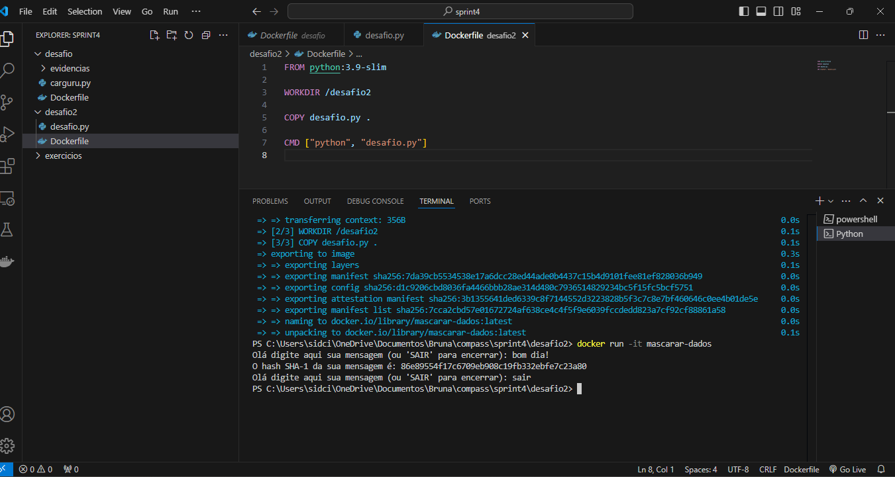

# Desafio – Sprint 4

Nesta Sprint, o desafio foi baseado no **Docker**. Apesar de não conhecer a ferramenta anteriormente, não encontrei grandes dificuldades, pois o conteúdo apresentado na trilha do curso abordou todos os pontos necessários para a realização do desafio.

A seguir, descrevo os passos que tomei para executar este desafio:

---

## **Etapa 1: Construir uma imagem e executar o código carguru.py**

O primeiro passo foi construir uma imagem a partir de um arquivo Dockerfile e utilizá-la para executar o código `carguru.py` fornecido. Para isso, criei o arquivo `Dockerfile` com as seguintes instruções:

- **`FROM python:3.9-slim`**  
  Escolhi a versão slim do Python, pois ela é mais compacta e eficiente. Como o código era simples, não havia necessidade de usar a versão completa.  
- **`WORKDIR /desafio`**  
  Defini o diretório de trabalho dentro do container com o nome `desafio`.  
- **`COPY carguru.py /desafio/`**  
  Copiei o script Python para o diretório do container.  
- **`CMD ["python", "carguru.py"]`**  
  Especifiquei o comando para executar o programa no momento em que o container for iniciado.  

### Dockerfile Criado:

Segue o arquivo `Dockerfile` criado:


## Conclusão da Construção e Execução do Container

Após concluir o desenvolvimento do arquivo **Dockerfile**, realizei a construção da imagem com o comando build. 


Em seguida, executei o container a partir da imagem criada, assegurando que o código fosse executado corretamente.


---

## **Etapa 2: Reutilização de Containers**

É possível reutilizar containers?
Sim! Depois que um container para de ser executado e esta parado, podemos reiniciá-lo e reutilizá-lo utilizando o comando `start`.

### Passos para Reutilizar Containers:

1. **Verificar Containers Parados**  
   O primeiro passo é identificar os containers parados. Para isso, utilizamos o comando:  
   ```bash
   docker ps -a

2. **Dar um start para a reutilização do container desejado**
    ```bash
    docker start <ID_DO_CONTAINER>
    ou
    docker start -a -i <ID_DO_CONTAINER> para iniciar esse container de maneira interativa no terminal

  
 

## **Etapa 3: Desenvolvimento e Execução do Script**

A terceira etapa consistia nos seguintes passos:  
- Criar um script em **Python** que:  
  - Recebesse uma string via input do usuário.  
  - Gerasse um hash da string utilizando o algoritmo **SHA-1**.  
  - Exibisse o hash gerado na tela.  
  - Retornasse ao passo inicial para aceitar novas entradas. 

  Realizei essa etapa do desafio com o código abaixo:

  

  ## **Criação da Imagem Docker: mascarar-dados**

Para criar uma imagem Docker chamada **mascarar-dados**, utilizei o seguinte **Dockerfile**:

- **`FROM python:3.9-slim`**: Escolhi novamente a versão **slim** do Python por ser mais compacta e eficiente.  
- **`WORKDIR /desafio2`**: Defini o diretório de trabalho no container como `/desafio2`.  
- **`COPY desafio.py .`**: Copiei o script `desafio.py` para o diretório de trabalho do container.  
- **`CMD ["python", "desafio.py"]`**: Configurei o comando que executará o script quando o container for iniciado.  
 
 A imagem a seguir mostar esse Dockerfile.

 

 Construi a imagem Docker.


Rodei um container a partir da imagem, enviando palavras para o mascaramento.




Depois reutilizei o container e fiz algumas execuções adicionais.


# Arquivos Gerados

Os arquivos Dockerfile e Python para a execução desse desafio podem ser encontrados aqui:


    

    


