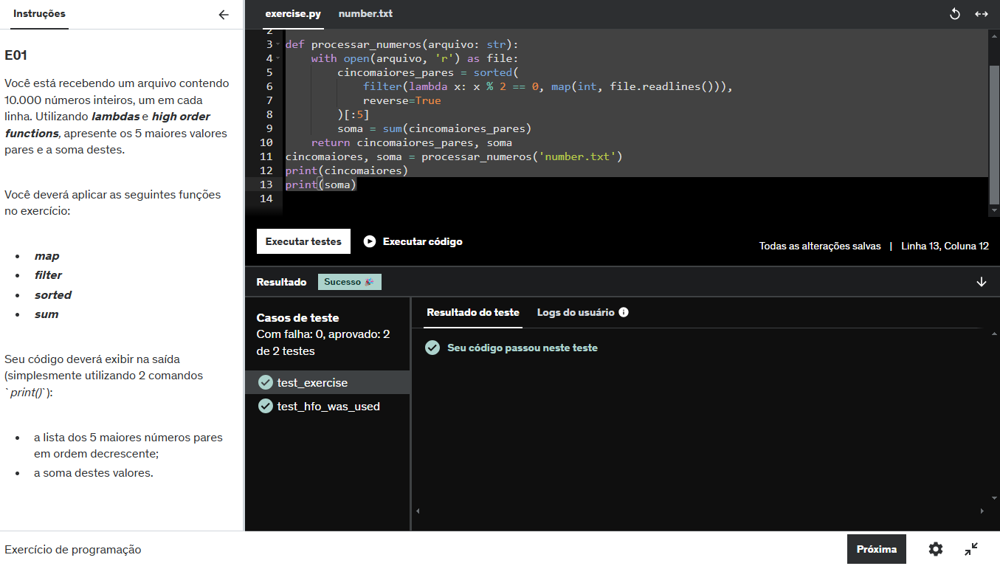
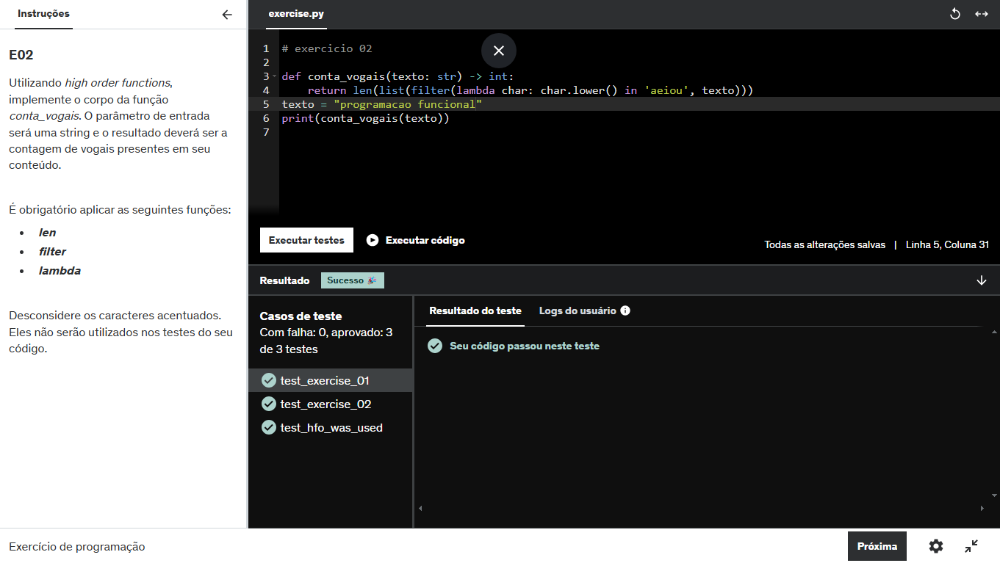
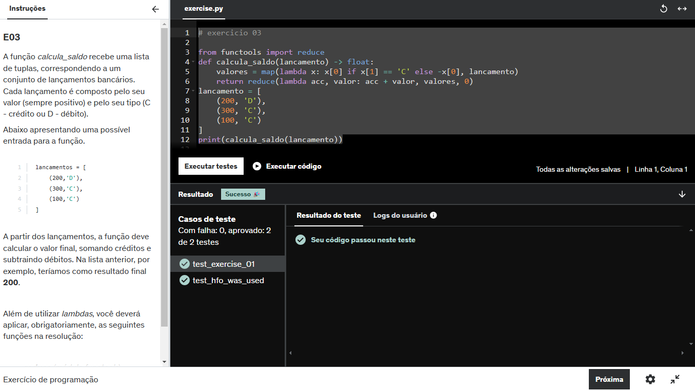
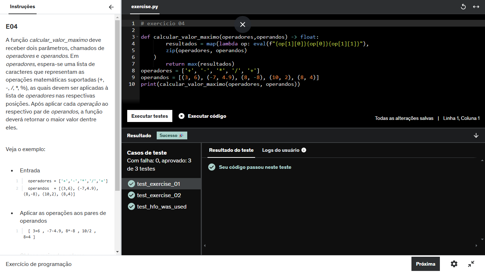
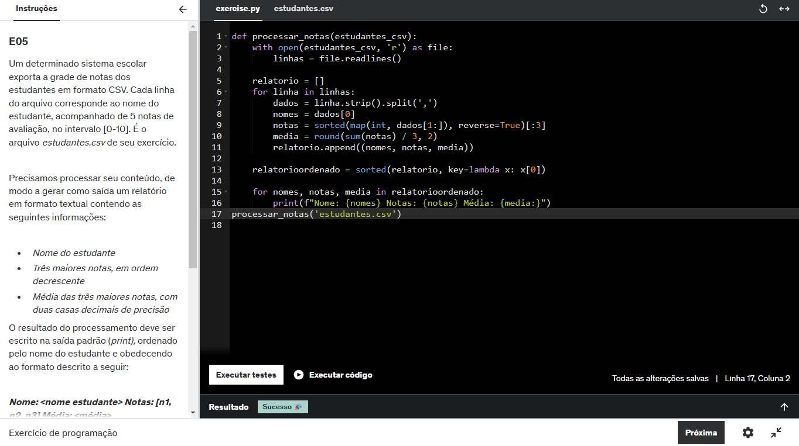
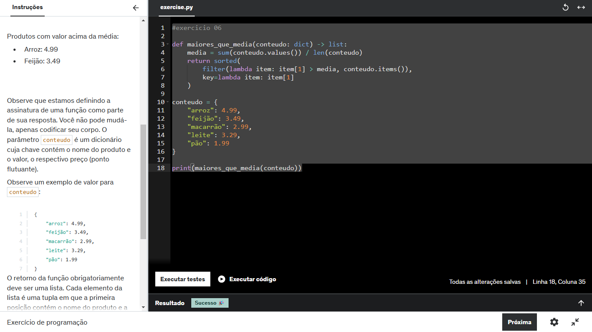
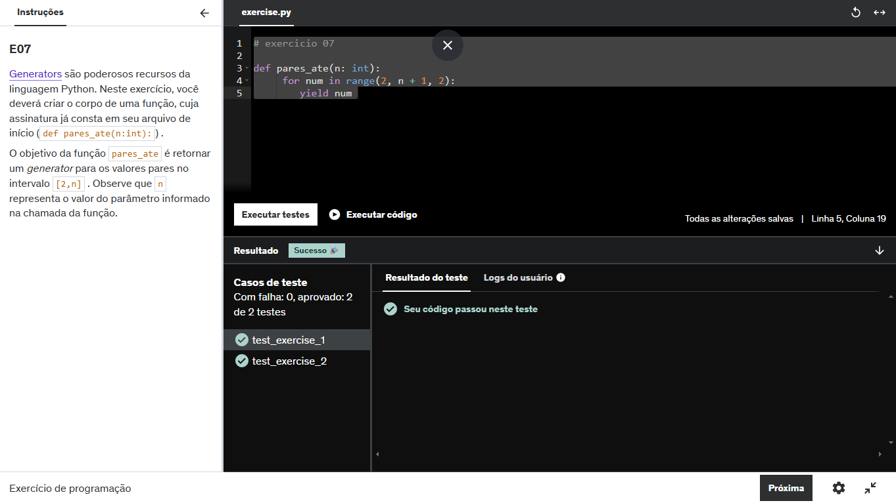

### Sprint 4

Na **Sprint 4**, fui introduzida à programação funcional. Sinceramente, achei o conceito bem difícil de compreender, e fazer os exercícios dessa sprint foi desafiador para mim. Além disso, fui apresentada ao **Docker**. Embora não tivesse conhecimento prévio, consegui entender o conceito de imagens e containers e executar o desafio.

Segue um breve resumo de cada curso dessa Sprint:

#### Programação Funcional com Python

O curso de **Programação Funcional com Python** proporcionou uma introdução a conceitos fundamentais desse paradigma, que visa tratar as funções como valores e prioriza a evitabilidade de mudanças de estado, promovendo um código mais limpo e previsível. Durante o curso, explorei diversos conceitos importantes, incluindo: Funções Lambda, map, composição de funções, imutabilidade e abordagem imperativa x funcional.

Com base no que aprendi, planejo aprofundar meus estudos nesse assunto, buscando uma compreensão mais detalhada das técnicas e melhores práticas da programação funcional, com o objetivo de aplicá-las efetivamente em projetos futuros.

#### Docker

O curso de **Docker** me proporcionou uma compreensão sólida sobre como utilizar essa ferramenta para facilitar o desenvolvimento e a gestão de ambientes isolados. Durante o treinamento, aprendi a trabalhar com diversas funcionalidades essenciais, incluindo: criação de imagens, gerenciamento de containers, desenvolvimento de volumes, orquestração de containers e revisão de comandos Linux, (aproveitei a oportunidade para revisar comandos essenciais do Linux, uma vez que a interação com o Docker frequentemente envolve a utilização de comandos do terminal). Essa revisão foi fundamental para aumentar minha familiaridade com a linha de comando e melhorar minha eficiência ao trabalhar com Docker.

Com o aprendizado adquirido, estou mais capacitada para aplicar o Docker em projetos reais, otimizando o desenvolvimento e a implantação de aplicações de maneira escalável e eficiente.

#### AWS Partner: Credenciamento (Técnico)

Neste curso de computação em nuvem com a **AWS**, adquiri um conhecimento técnico fundamental sobre a infraestrutura global e os diversos serviços oferecidos pela plataforma. O curso abordou como utilizar recursos da AWS para construir soluções arquitetônicas básicas, utilizando serviços de computação, armazenamento, redes, banco de dados, segurança e automação de infraestrutura.

Além disso, aprendi a avaliar e recomendar os produtos da AWS de forma estratégica, considerando as necessidades específicas dos clientes, o que me capacitou a tomar decisões informadas sobre qual serviço é mais adequado para cada situação.

## Exercícios 

Aqui estão os arquivos gerados para a execução dos exercícios dessa sprint.

01. [exercício1](../Sprint4/Exercicios/py/ex01.py)
02. [exercício2](../Sprint4/Exercicios/py/ex02.py)
03. [exercício3](../Sprint4/Exercicios/py/ex03.py)
04. [exercício4](../Sprint4/Exercicios/py/ex04.py)
05. [exercício5](../Sprint4/Exercicios/py/ex05.py)
06. [exercício6](../Sprint4/Exercicios/py/ex06.py)
07. [exercício7](../Sprint4/Exercicios/py/ex07.py)

## Evidências

A seguir seguem as evidencias da execução dos exercícios.

## Certificados

