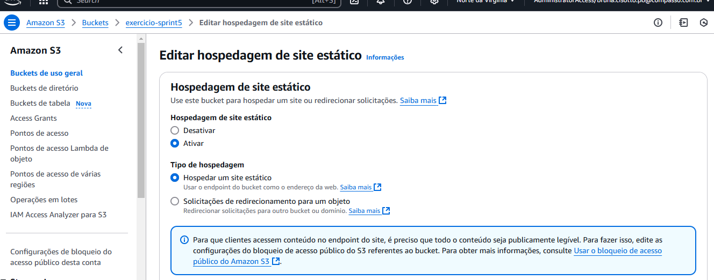
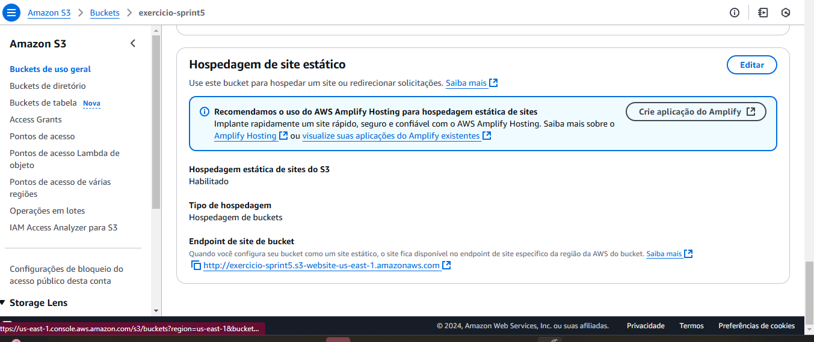

# Sprint 5: Explorando a Nuvem AWS

Nesta sprint, fomos introduzidos ao ambiente da nuvem AWS na prática. Tivemos a oportunidade de aprender por meio do jogo **Cloud Quest**, que simula a resolução de problemas reais com serviços da AWS, além de realizar um exercício passo a passo sobre como hospedar um site na nuvem. Também foi disponibilizado um curso preparatório para o exame de certificação **AWS Certified Cloud Practitioner (CLF-C02)**. 

O desafio principal desta sprint consistiu na análise de um banco de dados real, que deveria ser hospedado em um bucket. Foi uma sprint rica em desafios e novos aprendizados.

---

## **Cloud Quest**

O jogo **Cloud Quest** da AWS ensina habilidades de computação em nuvem de forma prática. Apesar de jogos eletrônicos não serem meu forte ou passatempo habitual, achei interessante a abordagem utilizada. Os conceitos teóricos são apresentados de maneira interativa, seguidos de laboratórios práticos que ajudam a consolidar o aprendizado. Mesmo enfrentando certa dificuldade com a dinâmica do jogo, reconheço seu valor educativo.

---

## **Curso Preparatório para o Exame AWS Certified Cloud Practitioner**  
**(CLF-C02 - Português)**  

O curso preparatório aborda os seguintes conteúdos:  
- Visão geral da AWS;  
- Arquitetura da nuvem;  
- Modelos de preço e suporte;  
- Segurança e conformidade.  

Além disso, inclui questões comentadas e simulados que auxiliam na preparação para o exame de certificação.

---

## **Exercício Prático: Hospedagem de Site Estático**

Nesta sprint, praticamos o uso de buckets para hospedar um site estático. Abaixo, os passos principais seguidos conforme as orientações do exercício:  

1. Criar um bucket no Amazon S3  

2. Configurar as propriedades do bucket para habilitar a hospedagem de site estático. 

3. Fazer upload dos arquivos HTML, CSS e JS para o bucket.  

4. Testar o acesso ao site por meio do endpoint gerado. 

Esta atividade proporcionou uma visão prática e aplicável do uso de buckets na nuvem para hospedar conteúdos estáticos.

O link para esse bucket está aqui:

[arnbucket] arn:aws:s3:::exercicio-sprint5
[linkbucket] https://exercicio-sprint5.s3.us-east-1.amazonaws.com/

o end point do site está aqui:

[endpoint] http://exercicio-sprint5.s3-website-us-east-1.amazonaws.com

## **Conclusão**

Foi uma sprint cheia de desafios e novos aprendizados. A experiência prática proporcionada pelo Cloud Quest, o curso preparatório e o exercício de hospedagem reforçaram a compreensão sobre os conceitos e ferramentas da nuvem AWS. Além disso, a análise de um banco de dados real hospedado em um bucket ampliou ainda mais a visão prática dos serviços da AWS.

## **Certificados**

[badgecloudquest](../Sprint5/Certificados/linkbadge.txt)
[badgeclouquestlink] https://www.credly.com/badges/b08ef381-bd55-4c1c-8196-201757093383/public_url
[cloudquestprint](../Sprint5/Certificados/capturadetelaclouquest.png)

