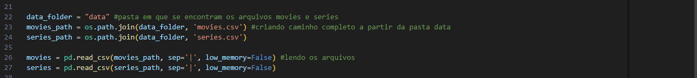

# Desafio Sprint 6

Este documento apresenta a primeira parte do desafio final (Entrega 1).
Sou da **Squad 6** nosso tema para o desafio final é **Terror/Mistério**.

### Objetivos do Desafio Final

Com base no tema proposto, pretendo responder às seguintes perguntas:  
1. Quais foram os 20 filmes mais populares do gênero terror/mistério na década de 1980?  
2. Qual foi o valor médio gasto nas produções desses filmes?  
3. Qual diretor acumulou mais premiações no período?  

A escolha da década de 1980 foi motivada pela sua relevância no gênero, marcada por clássicos como *O Boneco Assassino*, *A Hora do Pesadelo*, *O Iluminado* e *Cujo*, entre outros. Este período é uma rica fonte de análise e promete gerar insights interessantes ao longo das próximas Sprints.

---

## Desafio da Sprint 6

O desafio desta Sprint consistiu em realizar a ingestão de dois arquivos CSV para um bucket S3 na AWS, utilizando um pipeline de processamento implementado com **Python** e executado dentro de um **container Docker**.

### Etapas Executadas

1. Desenvolver um script em Python para leitura dos dois arquivos CSV e utilizar a biblioteca **Boto3** para realizar o upload dos arquivos para o bucket S3  

Importei as bibliotecas necessárias.

Criei as variaveis de ambiente e a sessão na AWS (a principio estava realizando o login usando o AWS CLI no meu ambiente local, o que gerou as credenciais necessárias no arquivo de configuração padrão, porém ao executar o script Python dentro do container Docker, o login falhou, pesquisei e descobri que foi porque o Docker cria um ambiente isolado e, por padrão, ele não tem acesso aos arquivos ou configurações armazenadas no meu sistema local, incluindo as credenciais da AWS. Por isso, decidi usar variáveis de ambiente para passar as credenciais da AWS diretamente ao container Docker.)

Li os arquivos movies e series

2. Configurar um caminho específico de diretórios no bucket para organização dos arquivos.  

Criei a função upload_s3 para simplificar o envio dos arquivos para o S3 fazendo isso em etapas 
Essa função inclui a data de processamento no caminho do S3, extrai o nome do arquivo parar criar o caminho no bucket, e faz o upload do arquivo com o caminho definido

Com o If __name__ == “__main__” quis garantir que esse script só será executado se for rodado diretamente
E não se for importado por outro script
Defini o nome do bucket, a camada e o local e chamei a função upload_s3 para enviar os arquivos 

3. Criar um container Docker com um volume apropriado para executar o script Python.

Primeiro criei uma pasta chamada data onde coloquei os arquivos movies e series.

E um arquivo requirements com as bibliotecas necessárias.

Depois criei o Dockerfile

[Dockerfile](../Desafio/Dockerfile)

A partir dai estava pronta para criar o container:

4. Executar o container localmente, garantindo a ingestão bem-sucedida dos arquivos no bucket S3.

Bucket na AWS 

Essa é a URL dos Buckets:

s3://desafiofinal-filmeseseries/raw/local/csv/movies/2024-12-31/movies.csv

s3://desafiofinal-filmeseseries/raw/local/csv/series/2024-12-31/series.csv

arn:aws:s3:::desafiofinal-filmeseseries

Aqui estão os arquivos Dockerfile e PY

[dockerfile](../Desafio/Dockerfile)

[py](../Desafio/desafio.py)

Esse processo integrou conhecimentos de programação, manipulação de dados e utilização de ferramentas de contêineres e computação em nuvem, preparando o terreno para as etapas futuras do desafio final.
