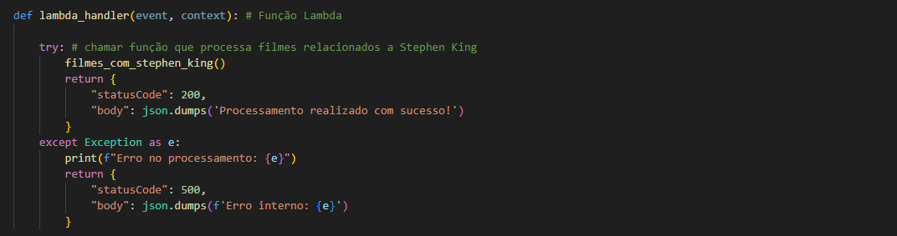
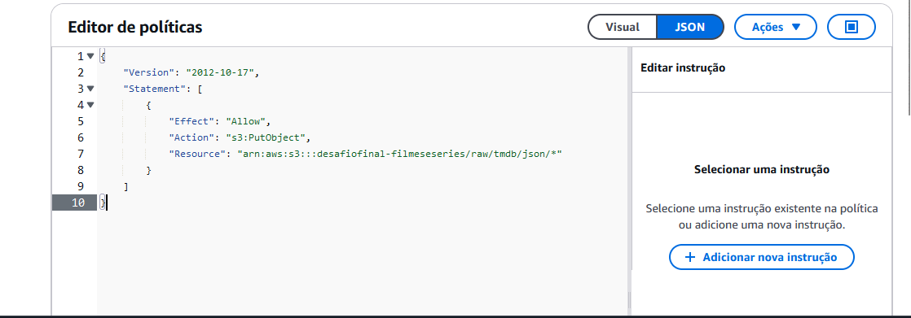
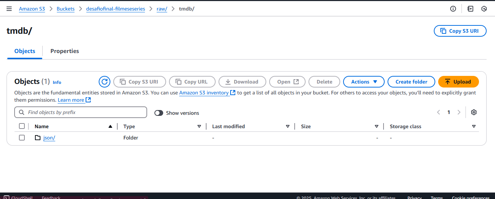

# Desafio Sprint 7

Nesta Sprint, o desafio consistia em consumir dados da API do TMDb para complementar as informações já disponíveis em um arquivo CSV utilizado na Sprint anterior, para tal deveriamos usar a função lambda da AWS.

## Tema da Análise
Inicialmente, planejei focar em filmes de terror e mistério dos anos 1980. No entanto, ao explorar os dados da API, percebi que muitos desses filmes eram baseados nas obras de Stephen King, um autor pelo qual tenho grande apreço. Por isso, decidi redirecionar a análise para examinar mais profundamente os filmes adaptados de suas obras.

## Questões de Pesquisa
Para esta análise, pretendo abordar as seguintes perguntas:

1. Qual é a porcentagem de filmes relacionados a Stephen King que pertencem ao gênero terror/mistério em comparação com outros gêneros?
2. Dentro do gênero terror/mistério, quais filmes foram os mais rentáveis (considerando a diferença entre o custo de produção e a arrecadação de bilheteria)?
3. Os filmes mais rentáveis foram também os mais bem avaliados? Existe alguma relação entre popularidade e sucesso financeiro?
4. Há alguma correlação entre diretores ou produtoras específicas e a popularidade dos filmes?
5. Entre os filmes mais populares, qual é a década de lançamento predominante? Eles tiveram mais sucesso em décadas anteriores ou ainda mantêm relevância atualmente?

## Etapas Realizadas
Para alcançar os objetivos propostos e cumprir o desafio da Sprint, executei as seguintes ações:

### Código Python

Importei as bibliotecas 

Inicializei o cliente S3

Criei e chamei uma função para os filmes relacionados com Stephen King, o código dele no TBDM é o 3027, armezei a minha chave API em uma variavel de ambiente na função lambda

Reuni os filmes que tinham o nome do autor no cast ou crew, criei uma lista vazia para armazenar os dados dos filmes.
O loop for filme in filmes percorre todos os filmes retornados pela API.
Usei a funcao obter_detalhes_completos sendo chamada usando o id do filme. Essa função retorna informações completas sobre o filme, como orçamento e receita.
A função obter_keywords é chamada para obter as palavras-chave relacionadas ao filme.
A função obter_diretor é chamada para identificar o diretor do filme a partir das informações de créditos.
Montei um dicionario de dados com as informacoes que julguei importantes trazer da API para a analise.
Usei a função upload_s3 para enviar os dados dos filmes processados para um bucket do S3

fiz essa função para buscar detalhes completos sobre um filme específico na API do TMDb, com base no ID do filme, incluindo detalhes adicionais como diretores

depois fiz uma função localiza o nome do diretor de um filme a partir dos dados de créditos fornecidos.

fiz essa função que recupera as palavras-chave associadas a um filme específico, usando o ID do filme e a API do TMDb.

por fim, uma função para enviar dados em formato JSON para o S3, organizando-os em grupos de 100 elementos e salvando-os com base em um esquema de pastas que utiliza a data atual.

## Depois desses passos parti para a criação da lambda

Comecei com a criação da camada, fiz diretamente no terminal contido na AWS

Concedendo permissao de gravação no S3

Execução da Lambda

Resultado Final no Bucket

## Aqui estão o código e os arquivos gerados 

[codigo](../Desafio/código%20python/desafio7.py)

[json1](../Desafio/json_gerados/filmes_stephen_king_brutos_1.json)

[json2](../Desafio/json_gerados/filmes_stephen_king_brutos_2.json)

[json3](../Desafio/json_gerados/filmes_stephen_king_brutos_3.json)

[json4](../Desafio/json_gerados/filmes_stephen_king_brutos_4.json)

