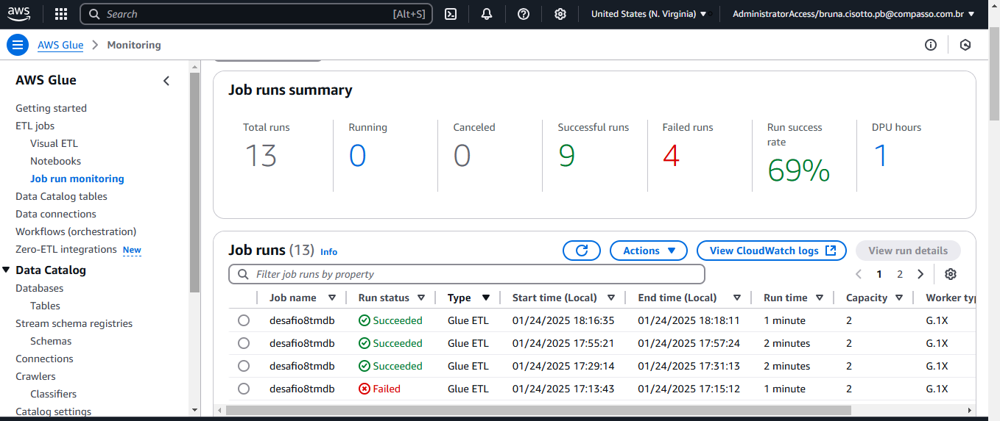

# Desafio - Sprint 8

## Tema da Análise
Inicialmente, planejei focar em filmes de terror e mistério dos anos 1980. No entanto, ao explorar os dados da API, percebi que muitos desses filmes eram baseados nas obras de Stephen King, um autor pelo qual tenho grande apreço. Por isso, decidi redirecionar a análise para examinar mais profundamente os filmes adaptados de suas obras.

## Questões de Pesquisa
Para esta análise, pretendo abordar as seguintes perguntas:

1. Qual é a porcentagem de filmes relacionados a Stephen King que pertencem ao gênero terror/mistério em comparação com outros gêneros?
2. Dentro do gênero terror/mistério, quais filmes foram baseados em livros do autor?
3. Dentro do gênero terror/mistério e que se originaram de livros quais os mais rentáveis (considerando a diferença entre o custo de produção e a arrecadação de bilheteria)?
4. Os filmes mais rentáveis foram também os mais bem avaliados? Existe alguma relação entre popularidade e sucesso financeiro?
5. Há alguma correlação entre diretores ou produtoras específicas e a popularidade dos filmes?
6. Entre os filmes mais populares, qual é a década de lançamento predominante? Eles tiveram mais sucesso em décadas anteriores ou ainda mantêm relevância atualmente?

## Motivadores das Apis 

-- "production_companies" e "director" - usarei para avaliar se alguma produtora, ou diretor tem mais sucesso quando relacionadas ao autor
-- "imdb_id" - usarei para unir com o CSV
-- "popularity" - usarei medir a popularidade dos filmes
-- "revenue" e "budget" - usarei para analisar o lucro de cada filme
-- "job" e "department" - usarei para saber como o autor se relaciona com cada filme, se foi escritor, ou se participou de algum modo da produção
-- 'keywords" - para saber se os "based on novel or book" tem mais sucesso

## Escopo da Sprint 8

Durante a Sprint 8, continuamos o trabalho no desafio final. O objetivo desta etapa foi utilizar o AWS Glue para processar os dados armazenados na camada **Raw** do S3 e transferi-los para a camada **Trusted**, no formato **Parquet**.

## Descrição do Desafio

No AWS Glue, foi necessário criar dois **Jobs** distintos:

1. **Job 1:** Processamento dos arquivos no formato CSV.
2. **Job 2:** Processamento dos arquivos no formato JSON.

A seguir, apresento os passos que segui para a execução desse desafio:

### Job 1 (CSV)

Coloquei no código o caminho que os dados deveriam ser consumidos/salvos, usei aqui apenas o csv Movies, pois não usarei o series em minha analise 

Li os arquivos da camada RAW

Removi as colunas do csv que não me serão uteis na analise 

Removi as linhas duplicadas e valores nulos

Converti a coluna anoLancamento que estava como string para inteiro 

Filtrei apenas filmes lançados a partir de 1960, como minha analise se baseia em filmes baseados na obra do autor, pesquisei seu ano de nascimento (1947) e como com 12 anos seria impossivel ele ter produzido e publicado obras escritas, cheguei a conclusão que a partir de 1960 seria uma data razoavel para usar como filtro

finalizei o código, gravando no S3 o arquivo devidamente tratado, no formato Parquet

Aqui estão os arquivos parquet gerados

[parquet1](../Desafio/parquet/parquetlocal/part-00000-022bb22b-9acc-4df5-92ee-ad969fcb92c0-c000.snappy.parquet)

[parquet2](../Desafio/parquet/parquetlocal/part-00001-022bb22b-9acc-4df5-92ee-ad969fcb92c0-c000.snappy.parquet)

[parquet3](../Desafio/parquet/parquetlocal/part-00002-022bb22b-9acc-4df5-92ee-ad969fcb92c0-c000.snappy.parquet)

[parquet4](../Desafio/parquet/parquetlocal/part-00003-022bb22b-9acc-4df5-92ee-ad969fcb92c0-c000.snappy.parquet)

### Job 2 (tmdb)

Defini o caminho do S3 que os dados deveriam ser consumidos/salvos

carreguei os arquivos json da Raw zone e converti para dataframe

transformei as arrays que estavam em keywords e production companies para strings

removi as linhas onde o id do imdb era nulo, pois vou precisar dessa chave para fazer o relacionameto dos dados, e linhas onde ela não estava disponivel não serão uteis para minha analise

escrevi os dados transformados em parquet no S3

Aqui estão os arquivos parquet gerados

[parquet1](../Desafio/parquet/parquettmdb/part-00000-3bc83858-442b-4f85-b8e4-45aa6ee6b986-c000.snappy.parquet)

[parquet2](../Desafio/parquet/parquettmdb/part-00001-3bc83858-442b-4f85-b8e4-45aa6ee6b986-c000.snappy.parquet)

[parquet3](../Desafio/parquet/parquettmdb/part-00002-3bc83858-442b-4f85-b8e4-45aa6ee6b986-c000.snappy.parquet)

[parquet4](../Desafio/parquet/parquettmdb/part-00003-3bc83858-442b-4f85-b8e4-45aa6ee6b986-c000.snappy.parquet)

### Resultados

#### Glue

Aqui estao as telas dos processamentos dos Jobs no Glue

#### Bucket 

Aqui está como ficou a estrutura de pastas no Bucket para CSV

Aqui está como ficou a estrutura de pastas no Bucket para TMDB

#### A execucão do Crawlers 

#### Athena

Aqui estão as tabelas geradas pelo Athena

[tabelacsv](../Desafio/tabelasathena/localathena.csv)

[tabelatmdb](../Desafio/tabelasathena/tmdbathena.csv)

Os arquivos com os códigos executados se encontram aqui

[codigopycsv](../Desafio/arquivospy/jobcsv.py)

[codigopytmdb](../Desafio/arquivospy/jobtmdb.py)

O caminho para o Bucket S3 é esse:

https://desafiofinal-filmeseseries.s3.us-east-1.amazonaws.com/trusted/

    

