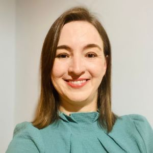

# Apresentação

Olá, sou a **Bruna Cisotto**

- **Localização:** Sorocaba – SP  
- **Instituição de Ensino:** UNIVESP  
- **Curso:** Bacharelado em Tecnologia da Informação  
- **Período:** 3º semestre  

---

Sou **Bruna Cristina de Freitas Cisotto**, residente em **Sorocaba – SP**, atualmente cursando o **Bacharelado em Tecnologia da Informação** pela **Univesp**, onde estou no terceiro semestre. No próximo ano letivo, terei a oportunidade de escolher a área de especialização dentro do eixo de tecnologia, e minha opção será **Ciência de Dados**.  

Possuo formação técnica em **Informática**, concluída em **2003**, embora não tenha exercido essa profissão. Ao longo da minha trajetória, atuei na área da saúde em funções administrativas, tanto no setor público quanto no privado. Mais recentemente, dediquei-me à carreira de artesã, especializando-me na confecção de bordados sob encomenda.  

Aprender é algo que valorizo profundamente. Ao decidir realizar uma **transição de carreira**, me comprometi a explorar esse novo universo com mente e coração abertos, aproveitando cada aprendizado e momento. Estou ciente de que a **resiliência, persistência e dedicação** serão fundamentais para o sucesso nessa jornada.  

Tenho como hobbies leitura, montagem de quebra-cabeças e assistir filmes.  
Também sou apaixonada por viajar, aprender novos idiomas, e conhecer diferentes lugares, culturas, pessoas e sabores.  

## Sprints 

1. [Sprint 1](https://github.com/Brunacisotto/programadebolsas/blob/main/Sprint1/Readme.md)

